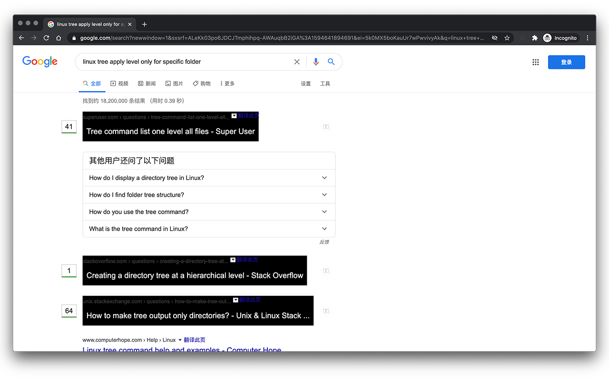

# SoRatings

A chrome extension that highlights the SO results in google search..

## Preview

## Notes

This is an improve for the original chrome extension [SO Google Enhancer](https://github.com/techsin/SoRatings), thx @techsin for the work.

improvements:

- fix the filter option for `onHeadersReceived` which leads to the fail of loading content form stackoverflow
- insteadof only works on `stackoverflow.com|stackexchange.com`, add supporting for all stackexchange domains. The domains are taken from here: https://meta.stackexchange.com/a/81383/335230.
